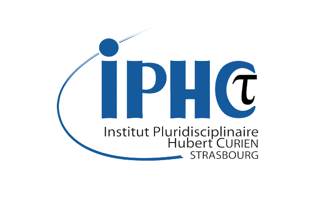

# Welcome to the IPHC Tau Organization :rocket:

## About Us :see_no_evil:
The IPHC Tau Organization represents the collaborative efforts of the *Institut Pluridisciplinaire Hubert Curien de Strasbourg* (IPHC) and the CMS working group dedicated to the study of tau leptons.

---

## Research Focus :crystal_ball:
Our team specializes in:

- **CP Violation in H → ττ Decays:** Investigating potential sources of CP violation in Higgs boson decays to tau pairs, contributing to our understanding of the matter-antimatter asymmetry in the universe.

- **Polarization in Z → ττ Decays:** Analyzing tau polarization effects in Z boson decays to refine our knowledge of weak interaction dynamics and test Standard Model predictions.
---

## Our Projects :computer:
We host and maintain several repositories, including:

- **Data Analysis :** Based on [columnflow](https://github.com/columnflow/columnflow) and [law](https://github.com/riga/law).
- **Database of physics processes:** Base on [cmsdb](https://github.com/uhh-cms/cmsdb).
---

## Website :page_facing_up:
[IPHC Official Site](https://www.iphc.cnrs.fr)

